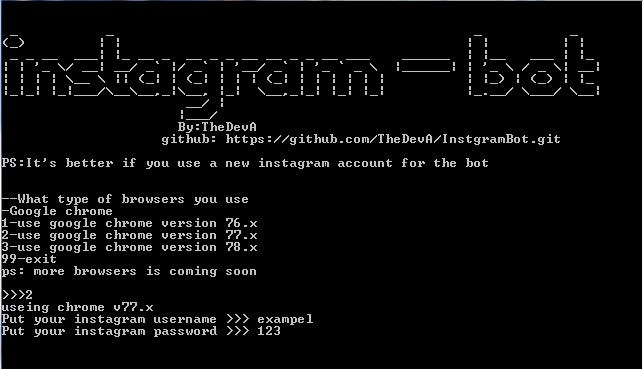
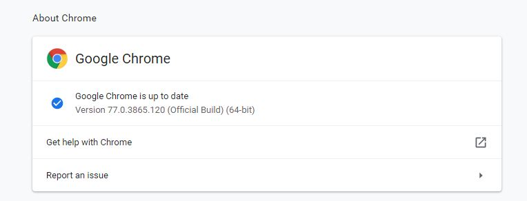

# InstgramBot
a simple python script that replica a human activity in instgram website
## screenshoots

## installation
* clone the repositori by typing in the terminal `git clone https://github.com/TheDevA/InstgramBot.git` or download the zip file
* enter the folder
* Run ` python InstgramBot.py ` or click on the executable file if you are in windows
## webdriver
you need to use the correct webdriver for the correct browser
### how do you know what version you should use ?
now the script support just google chrome (**more browsers coming**) so you should have google chrome installed to run the 
script **if you are using google chrome now you can copy this url to your tab bar ***chrome://settings/help*** **

  
## you should know
* **you should keep the driver folder with the script or the executable file**
* ***you should never rename the driver folder unless you modified the script***
* **there is a chance that instagram detect the bot so it's safe to use a new account for the bot**
## some explaining to some errors
*Message: no such window: window was already closed
  (Session info: chrome=77.0.3865.120)* **:meaning that the tab is closed**
*Message: chrome not reachable
  (Session info: chrome=77.0.3865.120)* **:meaning the google chrome window is closed**
>***All THE ERRORS ARE STORED IN ERRORS.TXT***
>
>*if you find any bugs please report it* ***HAVE FUN***
